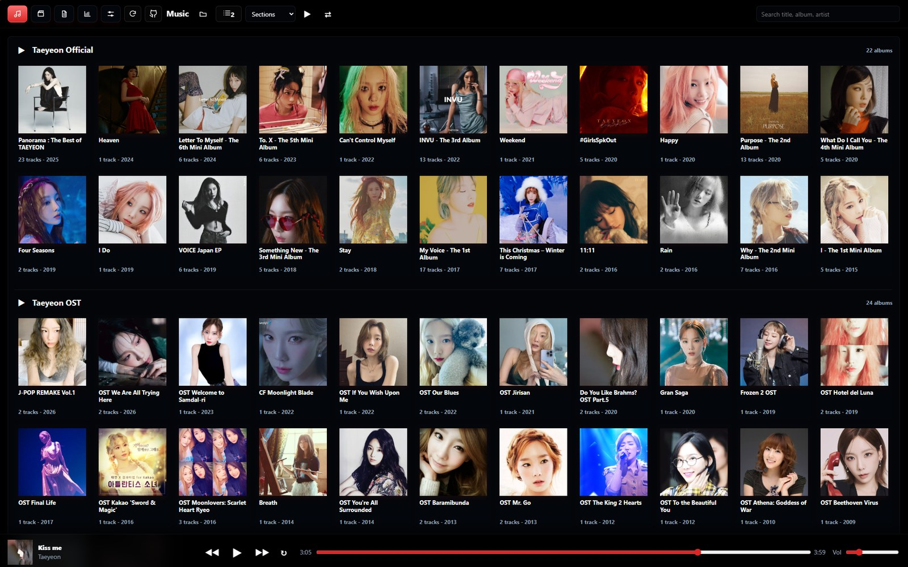
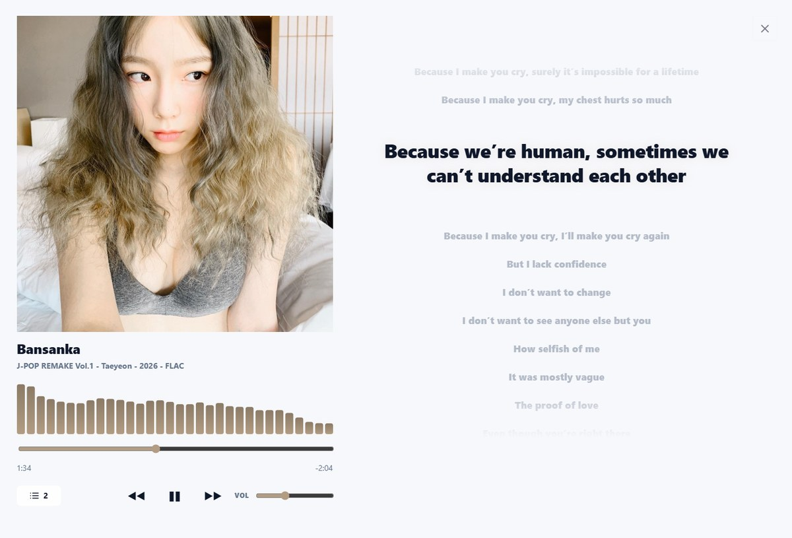
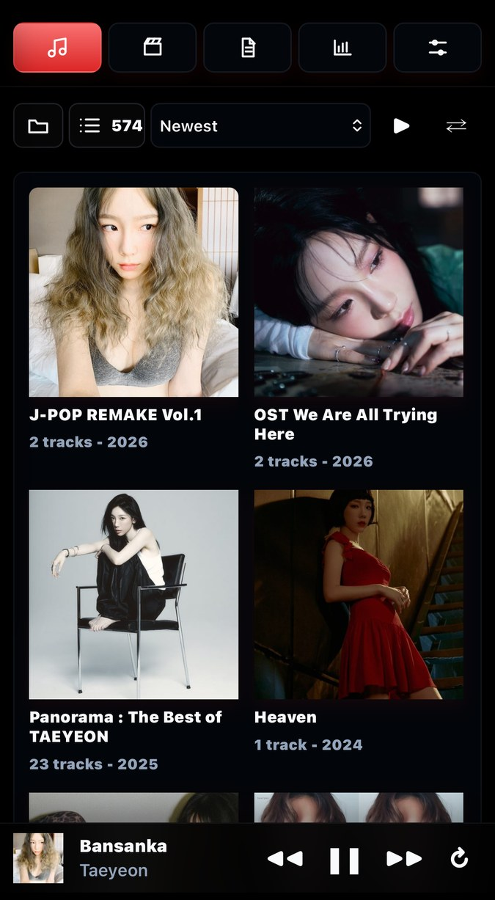
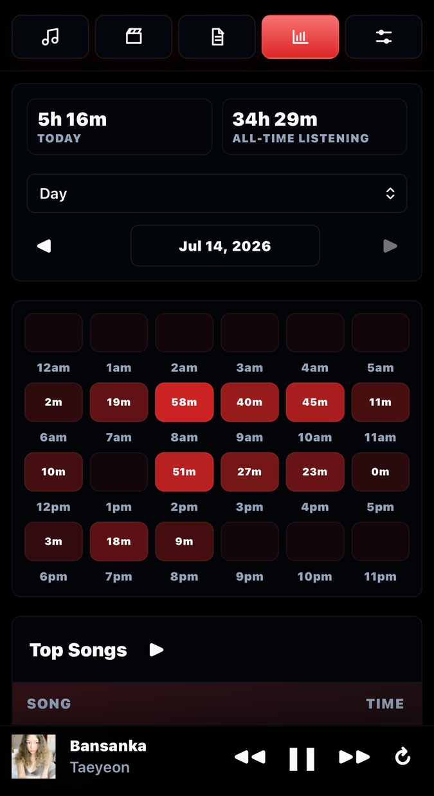

# Media Player

A local-first web player for music, video, lyrics, playlists, and text
collections. It runs one server on your computer and works in desktop and
mobile browsers.

## Screenshots





<p align="center">
  
  
</p>

## Features

- Music and video libraries with queues, resume, and playlists
- Embedded artwork, folder covers, and timed `.lrc` lyrics
- Now Playing visualizers and listening statistics
- Local text collections
- Responsive desktop and mobile UI
- Built-in touch game with bundled photo assets

Media files are not included.

## Getting Started

Requires Python 3.11 or newer.

```bash
python -m pip install -e .
```

Optional image resizing:

```bash
python -m pip install -e ".[images]"
```

Recommended launchers:

```text
windows_commands/start_launcher.cmd
mac_commands/start_launcher.command
```

Simple local launchers:

```text
windows_commands/start_player.cmd
mac_commands/start_player.command
```

The player runs on port `8766`. Open:

```text
http://127.0.0.1:8766/
```

## Command Line

The media directory is used only by the server running on your computer.

```powershell
media-player --media-dir <media-folder>
media-player --media-dir <media-folder> --host 0.0.0.0
```

The second command allows devices on the same network to open
`http://<lan-address>:8766/`. The launcher also supports Tailscale and a
temporary Cloudflare tunnel to this same server.

Reset the shared game record:

```bash
media-player --reset-game-record
```

## Configuration

Copy the example and adjust folder names, labels, and browse order:

```powershell
copy media_player_config.example.json media_player_config.json
```

More:

- [Usage](docs/USAGE.md)
- [Architecture](docs/ARCHITECTURE.md)
- [QA Checklist](docs/QA.md)
- [Security](SECURITY.md)

## License

MIT. See [LICENSE](LICENSE).
